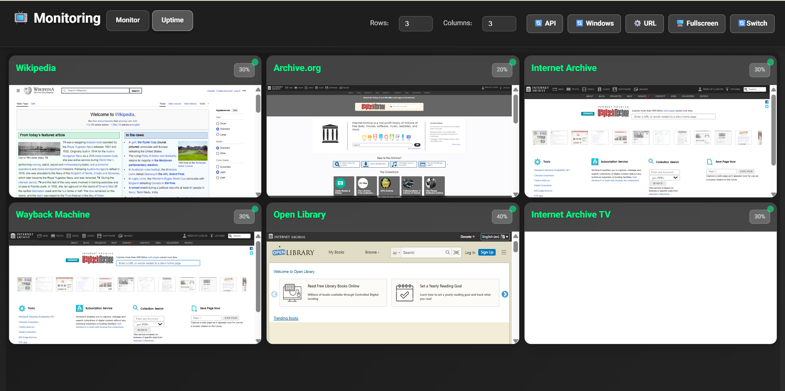

# Monitoring Board 📺

A modern monitoring dashboard for systems and services with multi-display support and responsive design.



## Features

- **Multi-Display**: Display multiple services simultaneously on one screen
- **Dynamic Tabs**: Easy switching between different monitor groups
- **Grid Settings**: Configurable rows and columns layout
- **Fullscreen Mode**: View any monitor in fullscreen mode
- **PWA Support**: Install as a native app
- **Auto Switch**: Automatic tab switching
- **API Integration**: Connect to external APIs for data
- **Responsive Design**: Works on all screen sizes

## Prerequisites

- Docker and Docker Compose
- Modern browser (Chrome/Edge/Firefox/Safari)
- API endpoint for data (optional)

## Quick Start

### Method 1: Docker Usage (Recommended)

```bash
# Clone the repository
git clone https://github.com/your-username/monitoring-board.git
cd monitoring-board

# Run with Docker Compose
docker-compose up -d

# Access dashboard
open http://localhost:8080
```

### Method 2: Static Deployment

```bash
# Upload files to any static host
# GitHub Pages, Vercel, Netlify, etc.
```

## Configuration

### API Configuration

1. Click the **⚙️ URL** button
2. Enter your API URL
3. Click **💾 Save and Load**

### JSON API Structure

```json
{
  "data": [
    {
      "title": "Tab Name",
      "monitor": [
        {
          "name": "Monitor Name",
          "url": "https://example.com",
          "zoom": 50,
          "width": 1
        }
      ]
    }
  ]
}
```

### Grid Settings

- **Rows**: Number of rows
- **Columns**: Number of columns
- **Auto Switch**: Automatic tab switching

## Advanced Features

### PWA Installation

- Click the **📱 Install App** button
- App will be installed on your device

### Fullscreen Mode

- Click on any monitor
- Or use the **🖥️ Fullscreen** button

### Auto Switch

- Enable the **🔄Switch** button
- Tabs will switch automatically

## Project Files

```
monitoring-board/
├── monitoring-board.html    # Main HTML file
├── manifest.json           # PWA manifest
├── sw.js                   # Service Worker
├── logo.jpg               # App icon
├── docker-compose.yml     # Docker configuration
├── nginx.conf             # Nginx configuration
└── README.md              # This file
```

## Deployment

### GitHub Pages

1. Push repository to GitHub
2. Go to Settings → Pages, select main branch
3. Site will be available at `https://username.github.io/repository-name`

### Vercel

```bash
# Install Vercel CLI
npm i -g vercel

# Deploy
vercel --prod
```

### Netlify

1. Drag & drop files to Netlify
2. Or use Git integration

## API Endpoints

### Get Data

```
GET /api/monitors
```

### Sample Response

```json
{
  "data": [
    {
      "title": "Production",
      "monitor": [
        {
          "name": "Server 1",
          "url": "https://server1.example.com",
          "zoom": 50,
          "width": 1
        }
      ]
    }
  ]
}
```

## Advanced Configuration

### CORS Headers

To display external websites, the server must send appropriate CORS headers:

```nginx
add_header Access-Control-Allow-Origin "*" always;
add_header Access-Control-Allow-Methods "GET, POST, OPTIONS" always;
add_header Access-Control-Allow-Headers "Origin, X-Requested-With, Content-Type, Accept" always;
```

### Security Headers

```nginx
add_header X-Frame-Options "SAMEORIGIN" always;
add_header X-Content-Type-Options "nosniff" always;
add_header X-XSS-Protection "1; mode=block" always;
```

## Development

### Code Structure

- **HTML**: Main user interface (single file)
- **CSS**: Styles and responsive design (embedded)
- **JavaScript**: Application logic and API calls (embedded)

### Adding New Features

1. Edit the `monitoring-board.html` file
2. Test with Docker: `docker-compose up -d`
3. Submit a Pull Request

### Docker Commands

```bash
# Build and run
docker-compose up -d

# View logs
docker-compose logs -f

# Stop
docker-compose down

# Rebuild
docker-compose up -d --build
```

## Contributing

1. Fork the repository
2. Create a feature branch (`git checkout -b feature/amazing-feature`)
3. Commit your changes (`git commit -m 'Add amazing feature'`)
4. Push to the branch (`git push origin feature/amazing-feature`)
5. Open a Pull Request

## License

MIT License - see the [LICENSE](LICENSE) file for details.

## Support

- **Issues**: [GitHub Issues](https://github.com/your-username/monitoring-board/issues)
- **Discussions**: [GitHub Discussions](https://github.com/your-username/monitoring-board/discussions)
- **Email**: your-email@example.com

## Changelog

### v1.0.0

- Initial release
- Multi-display support
- PWA support
- API integration
- Responsive design

---

**Note**: This project is designed for production use and follows security best practices.
